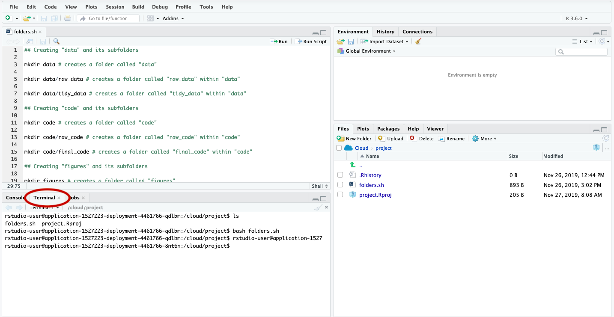
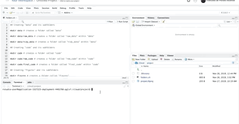

## Scripting, or how to make your computer take care of the boring stuff while you focus on what really matters: ~~napping~~ content

Producing content can be hard regardless of whether you're working on a manuscript, a blog post or on a data analysis project.
This process involves coming up with your content---which is tough on its own---and a whole bunch of repetitive tasks that are important to your end-product and to future-you.
These repetitive tasks consume your time, your focus, and increase the amount of typing you have to do.
Fortunately, you can leave a good portion them to someone that doesn't really mind repetition and happens to be quite good at it: your computer.
All you have to do give it some instructions and that's what you'll find here. 
In this post we'll use Bash scripting to easily create folders for our projects.
Oh, and we'll do it using RStudio.

```{r echo = FALSE, fig.cap="This doesn't have to be you. Unless you happen to be a cat who likes typing. Even so, it's your call."}
knitr::include_graphics("cat_typing.gif")
```

### Why RStudio?

Because RStudio offers an easy and platform-agnostic way of creating and executing Bash scripts.
Also, in case you're already using RStudio for your project you won't have to swap apps, which is more comfortable, right? :smiley:

In case you don't have RStudio installed in your computer you can either find instructions on how to do so [here](https://rstudio.com/) or use [Rstudio's cloud service](https://rstudio.cloud/)---kind of like Google Apps for Work (G Suite) but for RStudio.

I'll use RStudio cloud in case you were wondering.


<!--  -->


### Creating a folder structure using bash


The first step in every project is to give it a home.
Creating an informative folder structure makes organizing your files a no-brainer, which is great! 
It's also a completely mechanical process so let's put our computers in charge of doing that for us. 
We can do it using Bash in a few easy steps.

#### 1 --- Choose the a folder structure you like. 

I personally use (and like) the folder structure suggested by the instructors of the awesome [Cloud Based Data Science](https://leanpub.com/universities/set/jhu/cloud-based-data-science) course set, so that's the structure we'll create in this example.
By the way, in case you'd like to learn more about Data Science, R, Git and friends check their courses out! They are amazing!


```{r echo = FALSE, fig.cap="The folder structure we'll create in this example. Image from the _Cloud Based Data Science_ course set, specifically from the _Organizing Data Science Projects_ course."}
knitr::include_graphics("folder_str.png")
```

#### 2 --- Create your script

A script is a set of instructions for computers. 
There's a catch to using scripts though: computers are a bit like Drax the Destroyer from the the first Guardians of the Galaxy movie in the sense that they take things literally.

```{r echo = FALSE, fig.cap=""}
knitr::include_graphics("drax-over_my_head.gif")
```

So, stealing the example I heard from my friend[^1] 
[Bob](https://twitter.com/bob_solar), if your computer could do your groceries for you and you told it: 

[^1]: Bob, even though we haven't talked in a while I still think you're awesome!

> Go to the shop and buy bread, please. Oh, and if they have eggs bring me six.

You'd end up with something like this:

```{r echo = FALSE, fig.cap=""}

```

That being said let's jump to the actual scripting!

We'll create our script using a command language called Bash. 
It is widely used in Linux and macOS distributions and  can be used to manipulate data, move/rename files, and create folders (which is what we'll do here), for example.

Bash scripts are plain text files and creating them in RStudio(cloud) is quite easy. All we have to do it click "File > New File > Text File" and _voilà_.

```{r echo = FALSE, fig.cap=""}
knitr::include_graphics("text_file_creation.gif")
```

Now we'll write the actual instructions for our computers. 
We'll only use one command: `mkdir`. This command makes directories (as you might have guessed by its name).
To create directories using this command, you type `mkdir` and follow it by the folder name.
For instance, typing `mkdir cat-pics` creates a folder called "cat-pics".
We can create the folder structure from figure 2 by using the following commands:

```{bash, eval=FALSE}
## Creating "data" and its subfolders

mkdir data # creates a folder called "data"

mkdir data/raw_data # creates a folder called "raw_data" within "data"

mkdir data/tidy_data # creates a folder called "tidy_data" within "data"

## Creating "code" and its subfolders

mkdir code # creates a folder called "code"

mkdir code/raw_code # creates a folder called "raw_code" within "code"

mkdir code/final_code # creates a folder called "final_code" within "code"

## Creating "figures" and its subfolders

mkdir figures # creates a folder called "figures"

mkdir figures/exploratory # creates a folder called "exploratory" within "figures"

mkdir figures/explanatory # creates a folder called "explanatory" within "figures"

## Creating "products" and its subfolders

mkdir products # creates a folder called "products"

mkdir products/writing # creates a folder called "writing" within products
```

I know this seems lengthy but hey, once you've typed it you can make your computer execute the whole script with a single command.
That's the awesome part of using scripts for repetitive tasks. 
Also, the script above could be shorter.
It's possible to create multiple folders with a single `mkdir` call, for example.
I decided to make the script a little longer by having a single command/action per line because I think it makes it more understandable and it's easier add comments explaining what each line does.

Once we finish writing our script, we'll save it with the `.sh` extension.
To do this in RStudio we just click "save", and give the name we want to our script followed by `.sh`.
I decided to name our script `folders.sh`.
This specific script creates the folder structure we chose in the same directory as the script file is located. 
Since we're using the script to create a folder structure for our new projects, we'll save it in our project's main folder.

```{r echo = FALSE, fig.cap=""}
knitr::include_graphics("saved_script.png")
```


#### 3 --- Executing our script

Now that we have all the pieces we need to create our folder structure all we have to do is ask our computers to follow our instructions.
We do that using the terminal, also known as the command line.
There are different terminal applications out there so feel free to pick the one you like better.
I'll use RStudio's terminal.
To access RStudio terminal all you have to to is click the "Terminal" tab located next to the console.
When you switch to terminal, the usual `>` from RStudio's console turns into a `$`.

```{r echo = FALSE, fig.cap="RStudio's terminal window."}

```

Now that we've opened the terminal we'll figure out where are we.
To do that we'll use `pwd`, a command that prints the current working directory.

Regardless of where we are, we want to get to the same place we saved our script.
If you're using RStudio cloud or an RStudio project you should already be in the right place.
You can also use `ls` to show/list the contents of your current folder to make sure you are on the right place.

```{r echo = FALSE, fig.cap="The orange arrows show that the output of _pwd_ matches the project's main folder. The red arrow shows that our script (folders.sh) is among  the output of _ls_"}
knitr::include_graphics("folder_checking.png")
```

In case you're on a different folder, you should navigate to your project's main folder.
To do so you can use `cd` followed by a space and a directory name to move to a given directory.
In case you need to go back/a level up you can use `cd` followed by `..`.
While you're navigating your folders you might want `ls` to see which files/folders the directory you're currently at contains.


But assuming we're all where we want to be---our projects's main folder---how do we execute our script?
We type `bash folders.sh` in RStudio's terminal and see the magic happening:

```{r echo = FALSE, fig.cap="Execute the script and enjoy your new folders."}

```

And we're done! Now when you want to start a new project you can copy your folder-creation script to your new project's folder, execute and your good to go!

In case you want to learn more about using the command line, including scripts check out [this carpentry library](https://librarycarpentry.org/lc-shell/).

Any feedback is highly appreciated, just drop me a line using this website's contact form :smiley:

Cheers and thanks for reading,

F